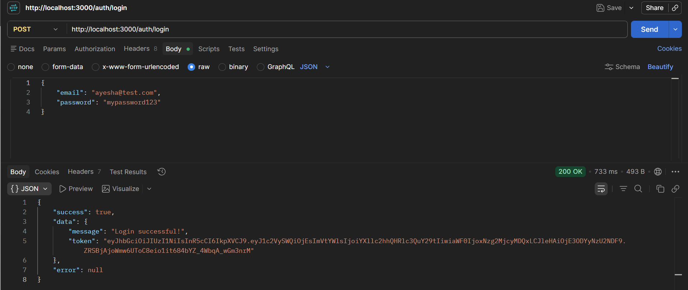
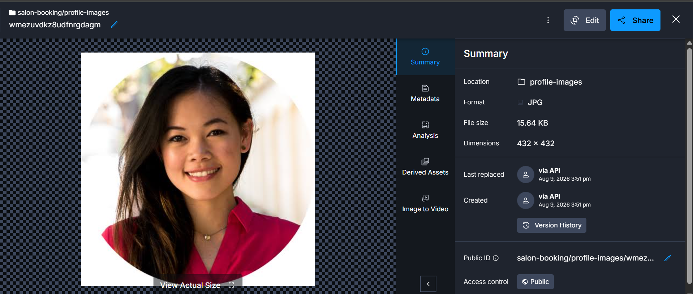
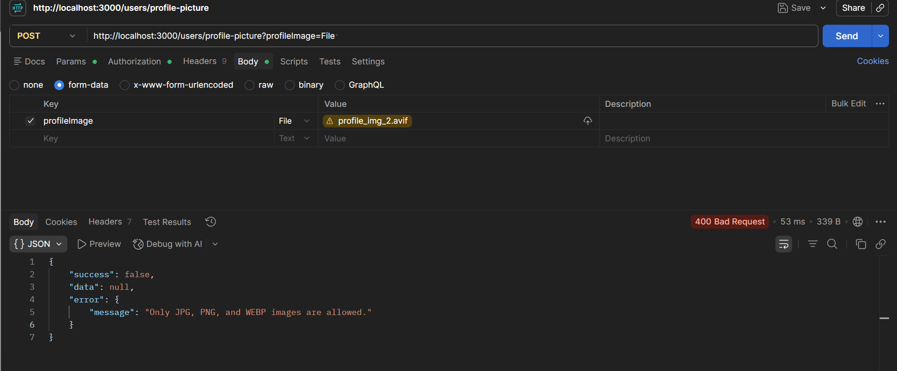
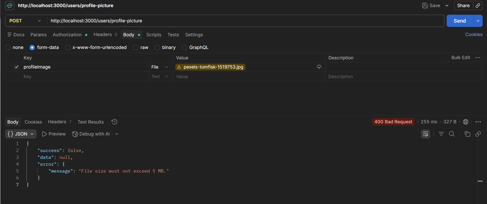
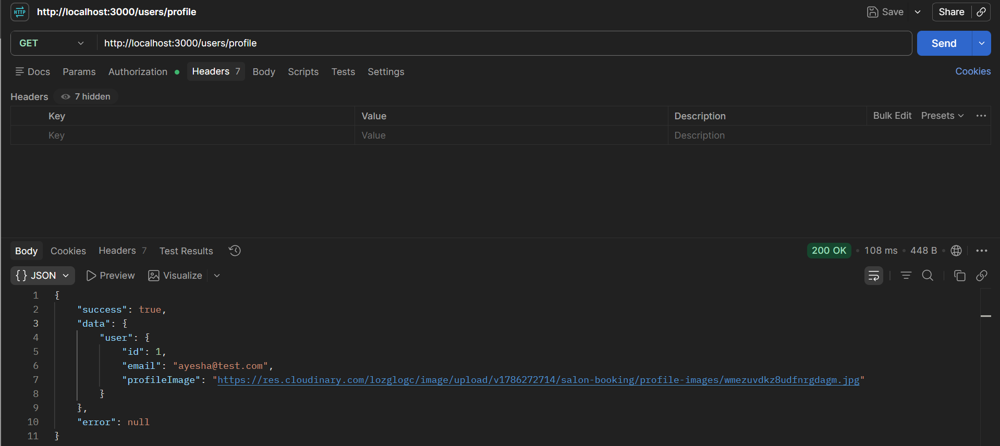

# Salon Booking API - File Upload & Storage

This task adds file upload functionality to the Salon Booking API. Users can upload a profile picture, the image is validated before upload, stored on Cloudinary, and the resulting URL is saved in PostgreSQL.

## Task Requirements

- Add an endpoint for file uploads
- Validate file type and size
- Store uploaded files using cloud storage
- Save the uploaded file URL in the database
- Handle upload failures with clear error messages
- Retrieve and display the uploaded file

## Tech Used

- Node.js
- Express.js
- PostgreSQL
- Sequelize
- Multer
- Cloudinary
- JWT Authentication

## File Upload

### POST `/users/profile-picture`

This endpoint allows an authenticated user to upload a profile picture.

The request uses `multipart/form-data`.

### Request

```text
POST /users/profile-picture
````

Authorization:

```text
Bearer <JWT token>
```

Form-data:

```text
profileImage: <image file>
```

## File Validation

Only the following image types are accepted:

* JPG / JPEG
* PNG
* WEBP

The maximum allowed file size is:

```text
5 MB
```

Invalid file types are rejected with a clear error message:

```json
{
    "success": false,
    "data": null,
    "error": {
        "message": "Only JPG, PNG, and WEBP images are allowed."
    }
}
```

Files larger than 5 MB are also rejected:

```json
{
    "success": false,
    "data": null,
    "error": {
        "message": "File size must not exceed 5 MB."
    }
}
```

## Cloudinary Storage

Uploaded images are stored in Cloudinary under:

```text
salon-booking/profile-images
```

The application uses Multer with memory storage, so the file is not permanently stored on the local server.

After a successful upload, Cloudinary returns a secure URL.

Example:

```json
{
    "success": true,
    "data": {
        "message": "Profile picture uploaded successfully!",
        "profileImage": "https://res.cloudinary.com/..."
    },
    "error": null
}
```

## Database Integration

The Cloudinary URL is stored in the `profileImage` field of the `Users` table.

The database stores the URL rather than the actual image file.

Example:

```text
Users
------------------------------------------------
id | email | profileImage
------------------------------------------------
1  | user@example.com | https://res.cloudinary.com/...
```

## Profile Retrieval

### GET `/users/profile`

This endpoint retrieves the authenticated user's profile information, including the stored profile image URL.

```text
GET /users/profile
```

Authorization:

```text
Bearer <JWT token>
```

Example response:

```json
{
    "success": true,
    "data": {
        "user": {
            "id": 1,
            "email": "user@example.com",
            "profileImage": "https://res.cloudinary.com/..."
        }
    },
    "error": null
}
```

The returned Cloudinary URL can then be opened in a browser to display the uploaded image.

## Error Handling

Upload errors are handled through the existing centralized error-handling middleware.

The API handles:

* Missing file
* Invalid file type
* Files larger than 5 MB
* Multer upload errors
* Cloudinary upload failures
* User not found errors

All errors follow the API's standard response format:

```json
{
    "success": false,
    "data": null,
    "error": {
        "message": "Error message"
    }
}
```

## Files Added / Updated

### Added

```text
middleware/upload.js
utils/cloudinaryUpload.js
```

### Updated

```text
models/User.js
middleware/errorHandler.js
server.js
```

The `User` model now includes:

```text
profileImage
```

## Testing

The following cases were tested:

* Successful profile picture upload
* JPG image upload
* Cloudinary storage
* Cloudinary URL returned by the API
* Cloudinary URL stored in PostgreSQL
* Profile image retrieval
* Invalid file type rejection
* File size limit rejection
* Missing file handling

## Screenshots

### 1. Successful Profile Picture Upload

The image is uploaded successfully and the Cloudinary URL is returned.



### 2. Cloudinary Storage

The uploaded image can be seen in the Cloudinary Media Library.



### 3. Profile Image URL Stored in PostgreSQL

The Cloudinary URL is stored in the `profileImage` field of the user's database record.


### 4. Invalid File Type

The API rejects unsupported file types.



### 5. File Size Validation

Files larger than 5 MB are rejected.



### 6. Profile Image Retrieval

The uploaded profile image URL is retrieved through the profile endpoint.



## Upload Flow

```text
Client
   |
   | multipart/form-data
   v
POST /users/profile-picture
   |
   v
JWT Authentication
   |
   v
Multer
   |
   +--> File type validation
   |
   +--> File size validation
   |
   v
Cloudinary
   |
   v
Cloudinary secure URL
   |
   v
PostgreSQL
   |
   v
Users.profileImage
   |
   v
GET /users/profile
   |
   v
Profile image URL
```

## Environment Variables

Cloudinary credentials are stored in the `.env` file and are not committed to GitHub.

Required environment variables:

```env
CLOUDINARY_CLOUD_NAME=your_cloud_name
CLOUDINARY_API_KEY=your_api_key
CLOUDINARY_API_SECRET=your_api_secret
```

Other existing environment variables required by the application should also be configured in `.env`.

## Running the Project

Install dependencies:

```bash
npm install
```

Start the development server:

```bash
npm run dev
```

The API runs on:

```text
http://localhost:3000
```

## Task Result

The file upload feature is now implemented using Cloudinary for cloud storage. Uploaded profile pictures are validated, stored securely, linked to the user's database record through the Cloudinary URL, and can be retrieved through the profile endpoint.
