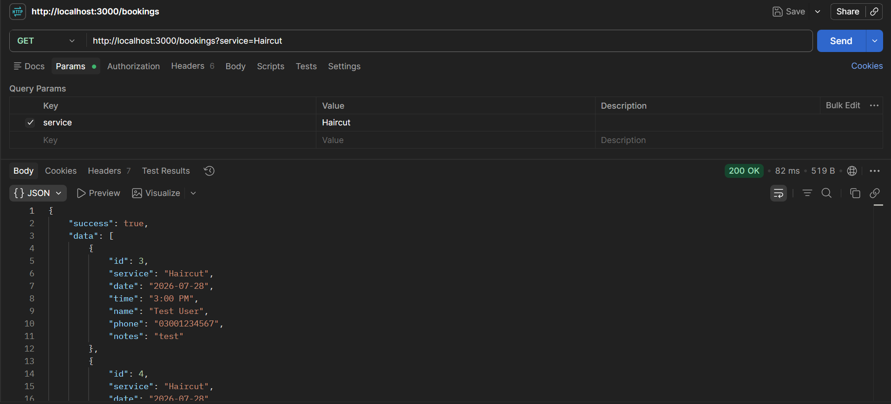
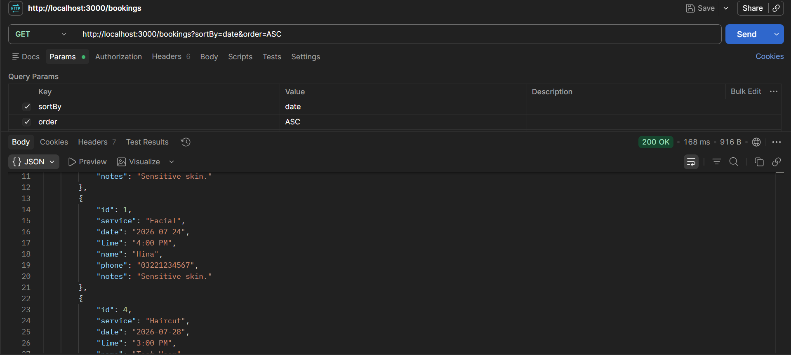
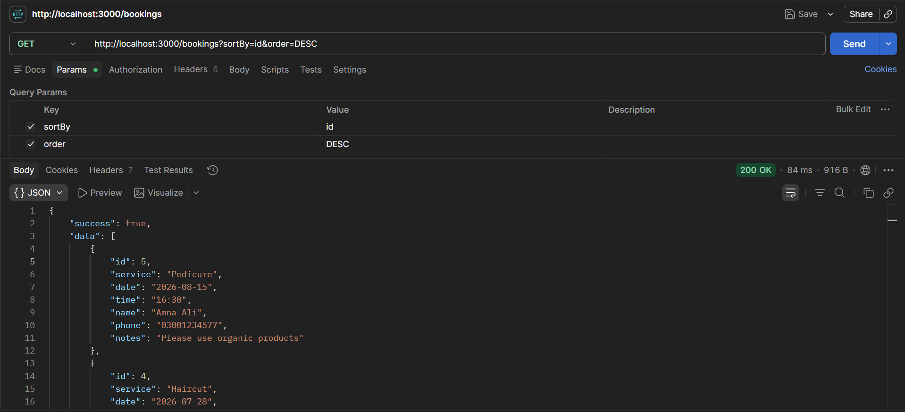
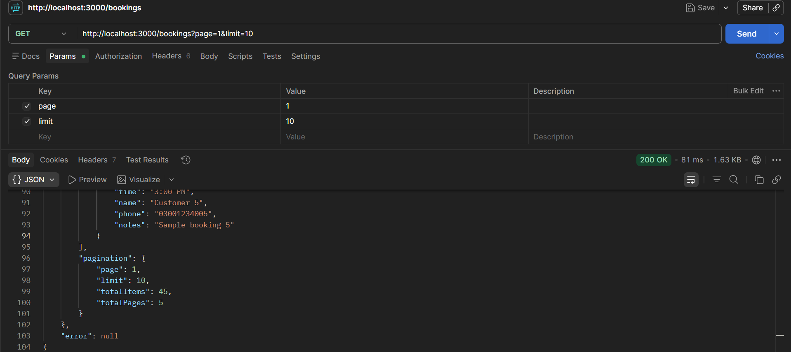
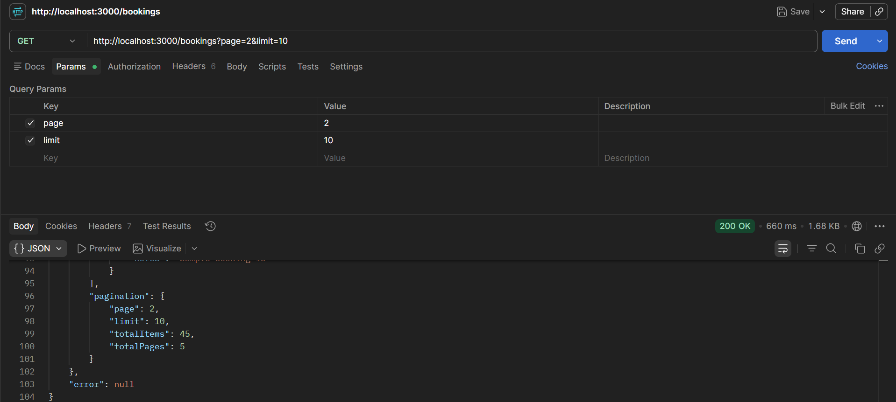
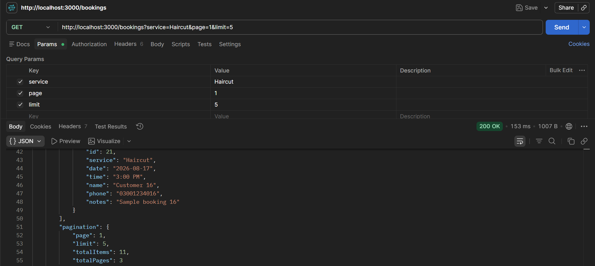

# Task 6 - Relationships, Filtering, Sorting, Pagination

This task focuses on working with real-world relational data instead of treating everything as a single flat list. The existing relationship between bookings and services is now used for filtering, sorting, and pagination, while a new Reviews resource was added to demonstrate a one-to-many relationship with services.

## What changed

### Service Relationships

The `Service` model now has two related resources:

* **Bookings** (existing relationship)
* **Reviews** (new relationship)

A service can have multiple bookings and multiple reviews. Both relationships are handled through the `serviceId` foreign key.

## Bookings - Filtering, Sorting, and Pagination

Previously, `GET /bookings` returned all bookings without any way to search or control the results.

Now it supports:

* filtering bookings by service name
* sorting results by different columns
* pagination using page and limit

### Available Queries

```
GET /bookings
GET /bookings?service=Haircut
GET /bookings?sortBy=date&order=desc
GET /bookings?page=2&limit=5
GET /bookings?service=Haircut&sortBy=date&order=desc&page=1&limit=5
```

### Query Parameters

| Parameter | Description                                         | Default |
| --------- | --------------------------------------------------- | ------- |
| service   | Filters bookings by service name (case-insensitive) | none    |
| sortBy    | Column used for sorting                             | id      |
| order     | Sorting direction (`asc` or `desc`)                 | asc     |
| page      | Page number                                         | 1       |
| limit     | Number of records per page                          | 10      |

The service filtering uses PostgreSQL `ILIKE`, which allows case-insensitive searching. For example, both `haircut` and `Haircut` return the same results.

### Pagination Response

The API now returns pagination information along with booking data:

```json
{
  "success": true,
  "data": [],
  "pagination": {
    "page": 1,
    "limit": 10,
    "totalItems": 23,
    "totalPages": 3
  }
}
```

## Reviews

A new Reviews resource was added where users can leave feedback for services.

Each review contains:

* rating (between 1 and 5)
* comment

### Create Review

```
POST /services/:id/reviews
```

Request body:

```json
{
  "rating": 5,
  "comment": "Loved it, will book again"
}
```

Validation rules:

* rating must be a whole number between 1 and 5
* comment cannot be empty
* service ID must exist before creating a review

If the service does not exist, the API returns a `404` response instead of creating an invalid review.

### Get Service Reviews

```
GET /services/:id/reviews
```

Returns all reviews belonging to a specific service.

The endpoint also returns `404` if the requested service does not exist.

## Endpoints Added in This Task

| Method | Route                   | Description                         | Needs Token? |
| ------ | ----------------------- | ----------------------------------- | ------------ |
| GET    | `/bookings`             | Filter, sort, and paginate bookings | No           |
| POST   | `/services/:id/reviews` | Add a review for a service          | No           |
| GET    | `/services/:id/reviews` | Get all reviews for a service       | No           |

## Implementation Notes

* Pagination uses simple offset-based pagination:

```
offset = (page - 1) * limit
```

* `totalPages` is calculated using:

```
Math.ceil(totalItems / limit)
```

This ensures the final page is included even when records do not divide evenly.

* Booking filtering uses Sequelize relationships with `include` and `findAndCountAll`, allowing the count to represent only the filtered results.

* Sorting currently accepts the column name provided through `sortBy`. In a production application, allowed sorting columns should be whitelisted to prevent unsafe query inputs.

## Database Seeding

Sample data was added to properly test filtering, sorting, and pagination with a realistic dataset.

The database was populated with more than 30 booking records across different services, allowing testing of:

* service-based filtering
* ascending and descending sorting
* pagination across multiple pages

## Testing

All endpoints were manually tested using Postman.

Tested scenarios include:

* filtering bookings by service name
* sorting bookings in ascending and descending order
* pagination across multiple pages
* creating reviews with valid data
* handling invalid service IDs
* retrieving reviews for specific services

## Screenshots

Screenshots of testing results:

### Filtering Bookings by Service

[](screenshots/filter-bookings-by-service.png)


### Sorting Bookings Ascending

[](screenshots/sort-bookings-ascending.png)


### Sorting Bookings Descending

[](screenshots/sort-bookings-descending.png)


### Pagination - Page 1

[](screenshots/pagination-page.png)


### Pagination - Page 2

[](screenshots/pagination-page-2.png)


### Filtering and Pagination Together

[](screenshots/filtering-and-pagination.png)

## Author

Ayesha Cheema

GitHub: github.com/ayeshaacheema
