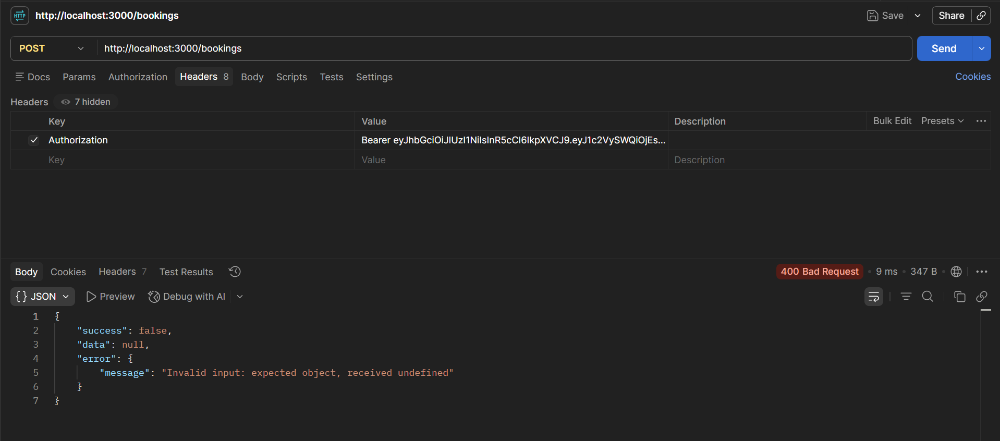
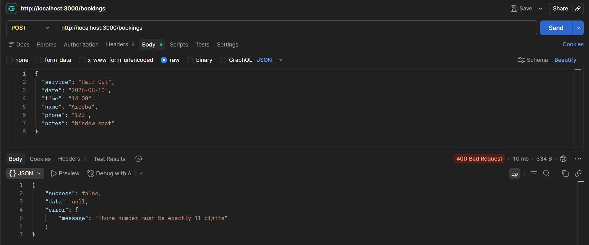
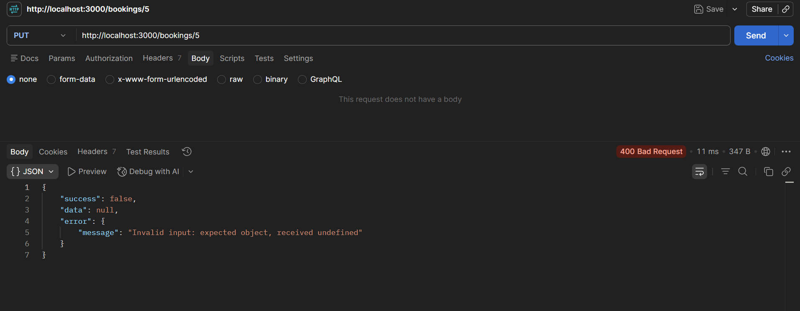
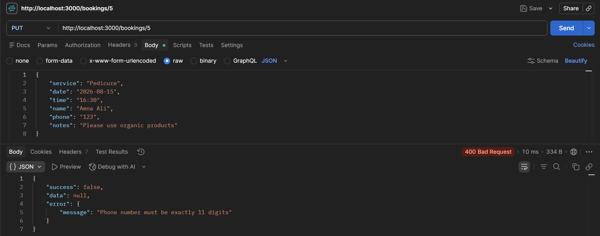
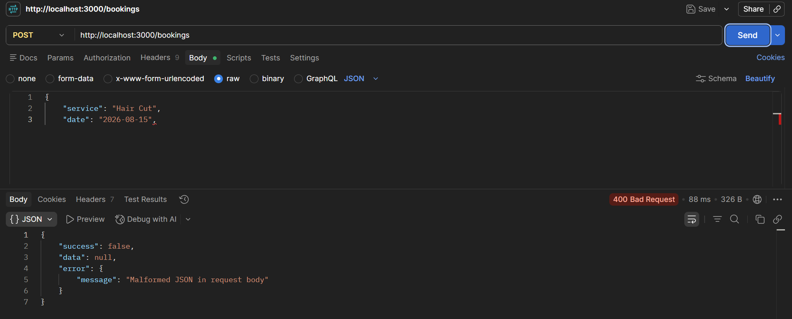
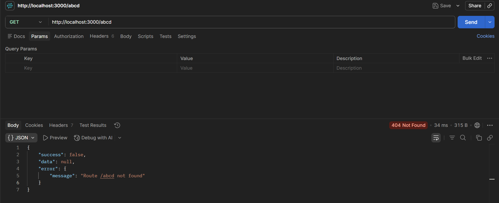
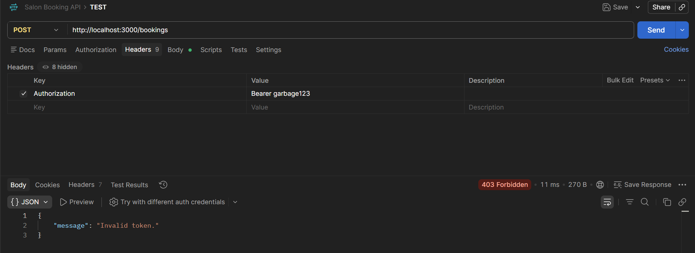

# Week 3 - Input Validation & Error Handling

Up to this point the API would happily accept whatever got sent to it. This update is about not trusting that anymore - validating incoming data, catching failures before they turn into crashes, and making sure every response, success or error, comes back in the same shape.

## What changed

- Request validation using Zod
- One centralized error handling middleware instead of scattered try/catch blocks
- A single, consistent response format across every endpoint
- Validation added to the auth and booking routes
- Malformed JSON no longer crashes the server, it just returns a proper error
- Bad IDs, empty bodies, and wrong input formats all get handled instead of ignored

## Response format

Every response looks the same now, whether it worked or not.

**Success**
```json
{
  "success": true,
  "data": { "..." },
  "error": null
}
```

**Error**
```json
{
  "success": false,
  "data": null,
  "error": {
    "message": "Description of the error"
  }
}
```

Doesn't matter which endpoint you hit or what went wrong, the shape is always the same. Makes it a lot easier to handle on the frontend without special-casing every route.

## How this actually works under the hood

None of this is magic, just a few small pieces working together so I'm not repeating myself in every route:

- **`utils/response.js`** - two tiny helpers, `sendSuccess` and `sendError`. Every route calls one of these instead of writing `res.json({...})` by hand each time, so the shape can't accidentally drift between endpoints.

- **`utils/AppError.js`** - a small class that extends the built-in `Error`. When I throw one of these, it carries a `statusCode` along with it and gets flagged as `isOperational`, so the error handler knows it's an error I threw on purpose (like "booking not found") and not something that blew up unexpectedly.

- **`utils/catchAsync.js`** - wraps async route handlers so I don't have to write `try/catch` in every single one. If a promise inside a route rejects, this catches it and passes it straight to `next()`, which sends it to the error handler.

- **`middleware/validate.js`** - takes a Zod schema and runs it against `req.body` before the route logic even runs. If it fails, it collects the issue messages and throws an `AppError` with a 400 status. If it passes, it just calls `next()` and the route runs as normal.

- **`middleware/errorHandler.js`** - the last stop for anything that goes wrong. It checks what kind of error it got (malformed JSON, a Sequelize unique constraint, a Sequelize validation error, one of my own `AppError`s, or something unexpected) and calls `sendError` with the right status code and message for each case. Anything it doesn't recognize falls through to a generic 500 so the actual error still gets logged on the server but the client never sees raw internals.

So the flow for something like creating a booking is: request comes in, `validate(bookingSchema)` checks the body first, then the route runs inside `catchAsync`, and if anything throws at any point (bad input, booking not found, a database error) it all lands in the same `errorHandler` and goes out through `sendError`. One path in, one path out, regardless of what broke.

## Validation

Added to any endpoint that takes user input. Covers:

- required fields actually being present
- correct data types
- phone number format (11 digits)
- empty strings
- password requirements
- the request body actually having the shape it's supposed to

All of it runs through Zod schemas before the request reaches the controller logic, so a bad request gets rejected early instead of failing halfway through a database call.

## Examples

### Empty request body

```
POST /bookings
{}
```

`400 Bad Request`
```json
{
  "success": false,
  "data": null,
  "error": {
    "message": "Service is required, Date is required, Time is required, Name must be at least 2 characters, Phone number must be exactly 11 digits"
  }
}
```

### Invalid phone number

```
POST /bookings
{
  "service": "Hair Cut",
  "date": "2026-08-15",
  "time": "14:00",
  "name": "Ayesha",
  "phone": "123"
}
```

`400 Bad Request`
```json
{
  "success": false,
  "data": null,
  "error": {
    "message": "Phone number must be exactly 11 digits"
  }
}
```

### Duplicate email on signup

```
POST /auth/signup
{
  "email": "ayesha@test.com",
  "password": "mypassword123"
}
```
(email already exists)

`400 Bad Request`
```json
{
  "success": false,
  "data": null,
  "error": {
    "message": "Email already in use."
  }
}
```

### Wrong login credentials

```
POST /auth/login
{
  "email": "ayesha@test.com",
  "password": "wrongpassword"
}
```

`401 Unauthorized`
```json
{
  "success": false,
  "data": null,
  "error": {
    "message": "Invalid email or password."
  }
}
```

### Malformed JSON

```
POST /bookings
{
  "service": "Hair Cut",
  "date": "2026-08-15",
```
(request cuts off, invalid JSON)

`400 Bad Request`
```json
{
  "success": false,
  "data": null,
  "error": {
    "message": "Malformed JSON in request body"
  }
}
```

## Other edge cases covered

- invalid booking IDs (update/delete on something that doesn't exist)
- missing auth tokens on protected routes
- invalid or tampered JWTs
- hitting a route that doesn't exist at all
- empty update requests
- update requests with the wrong fields

None of these crash the server. They all come back as a normal error response with a sensible status code.

## Testing

All of this was tested manually in Postman. Screenshots below.

### Empty request body validation
POST `/bookings`

[](screenshots/booking_validation_empty_body.png)

### Invalid phone number validation
POST `/bookings`

[](screenshots/booking_validation_invalid_phone.png)

### Update booking with empty body
PUT `/bookings/:id`

[](screenshots/booking_update_empty_body.png)

### Update booking with invalid phone number
PUT `/bookings/:id`

[](screenshots/booking_update_invalid_phone.png)

### Malformed JSON handling
POST `/bookings`

[](screenshots/malformed_json.png)

### Invalid route handling
Hitting a route that doesn't exist:

[](screenshots/invalid_route.png)

### Auth error handling
Request with an invalid token:

[](screenshots/auth_invalid_token.png)

## Author

Ayesha Cheema
github.com/ayeshaacheema
