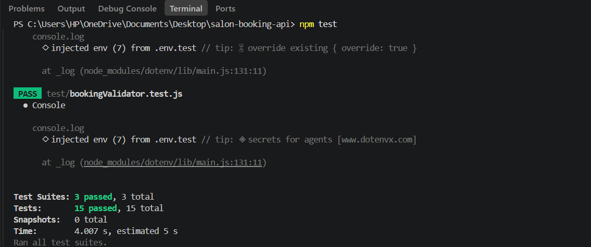
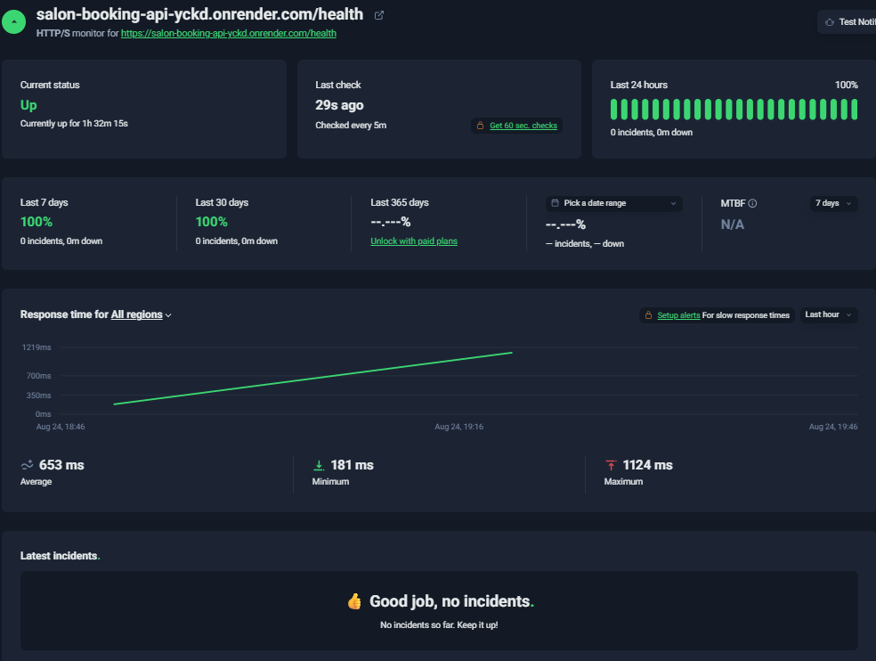
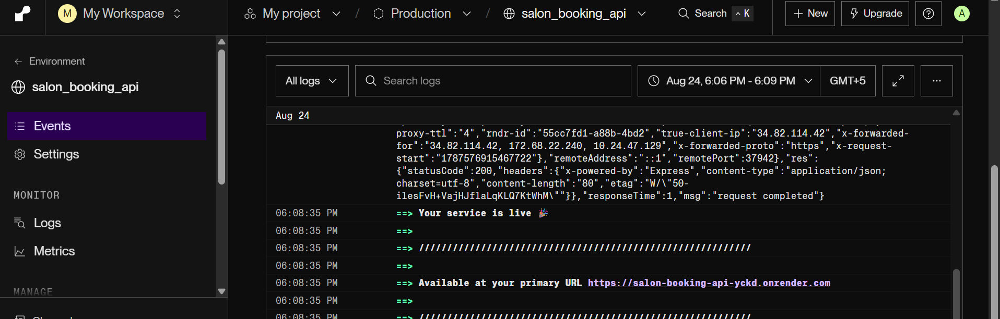
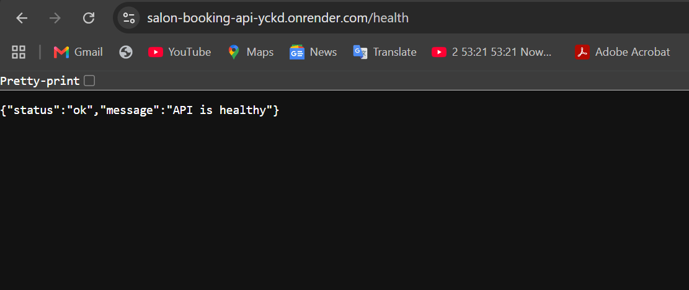

# Salon Booking API

A backend REST API for a salon booking system built with Node.js, Express, PostgreSQL, Sequelize, JWT authentication, validation, role-based authorization, file uploads, reviews, and automated testing.

## Tech Stack

* **Runtime:** Node.js
* **Framework:** Express.js
* **Database:** PostgreSQL
* **ORM:** Sequelize
* **Authentication:** JWT
* **Validation:** Zod
* **Testing:** Jest + Supertest
* **File Uploads:** Multer + Cloudinary
* **Logging:** Pino + pino-http
* **API Hosting:** Render
* **Database Hosting:** Neon PostgreSQL
* **Monitoring:** UptimeRobot

---

# Task 9 — Testing and API Documentation

## Overview

This task focuses on proving that the API works through automated tests and documenting the available API endpoints.

The requirements were:

* Unit tests for at least 2 core pieces of logic
* Integration tests for at least 5 API endpoints
* A happy path and at least one failure case for each integration endpoint
* Automated testing using a framework native to the stack
* API documentation
* A summary of what is and isn't covered by the tests

---

## 1. Automated Testing Setup

The project uses **Jest** as the testing framework and **Supertest** for sending HTTP requests to the Express application.

Run the test suite with:

```bash
npm test
```

---

## 2. Test Database Setup

A separate test environment is used for automated tests.

Before testing, the database is authenticated and reset:

```js
beforeAll(async () => {
    await sequelize.authenticate();
    await sequelize.sync({ force: true });
});
```

After testing, the database connection is closed:

```js
afterAll(async () => {
    await sequelize.close();
});
```

Using `sync({ force: true })` gives the tests a clean database state.

---

## 3. Unit Tests

### Booking Validation — `test/bookingValidator.test.js`

Tests include:

* Valid booking data → accepted
* Invalid booking data → rejected

### Authorization — `test/authorize.test.js`

Tests include:

* User with the required role → allowed
* User without the required role → `403 Forbidden`

These tests verify core validation and authorization logic independently.

---

## 4. Integration Tests

Integration tests verify that routes, middleware, authentication, validation, database operations, and responses work together.

| Endpoint                    | Happy Path                    | Failure Path            |
| --------------------------- | ----------------------------- | ----------------------- |
| `POST /auth/signup`         | Valid signup → `201`          | Invalid data → `400`    |
| `POST /auth/login`          | Valid credentials → `200`     | Wrong password → `401`  |
| `GET /services/:id/reviews` | Existing service → `200`      | Missing service → `404` |
| `POST /bookings`            | Authenticated request → `201` | No token → `401`        |
| `GET /users/profile`        | Authenticated user → `200`    | No token → `401`        |

---

## 5. Final Test Results

The final automated test run produced:

```text
Test Suites: 3 passed, 3 total
Tests:       15 passed, 15 total
Snapshots:   0 total
```

**Result: 15/15 tests passed.**

### Test Result Screenshot

Add the test-result screenshot stored in the repository here:

```markdown

```

---

## What Is Covered

### Unit Tests

* Booking validation
* Role-based authorization

### Integration Tests

* User signup
* User login
* JWT authentication
* Service review retrieval
* Booking creation
* User profile retrieval
* Authentication failure
* Validation failure
* Invalid credentials
* Missing resources

---

## What Is Not Covered

The following areas are currently outside the automated test suite:

* `PUT /bookings/:id`
* `DELETE /bookings/:id`
* `POST /services/:id/reviews`
* `POST /users/profile-picture`
* Cloudinary upload/failure scenarios
* Every possible filtering, sorting, and pagination combination
* All possible database failure scenarios

These features may have been tested manually, but they are not included in the current automated test coverage.

The **15/15 passing result confirms that the tested scenarios work correctly, but it does not represent complete automated coverage of the entire API.**

---

# API Documentation

## Authentication

```text
POST /auth/signup
POST /auth/login
```

## Bookings

```text
GET    /bookings
POST   /bookings
PUT    /bookings/:id
DELETE /bookings/:id
```

`GET /bookings` supports filtering, sorting, and pagination.

## Reviews

```text
POST /services/:id/reviews
GET  /services/:id/reviews
```

## User

```text
GET  /users/profile
POST /users/profile-picture
```

## Health Check

```text
GET /health
```

## Root Endpoint

```text
GET /
```

Protected endpoints require:

```text
Authorization: Bearer <JWT_TOKEN>
```

`DELETE /bookings/:id` additionally requires the `admin` role.

---

# Production Deployment, Logging & Monitoring

## Overview

The API has been deployed to a live production environment with a hosted PostgreSQL database, environment-based secrets, structured logging, process reliability, and uptime monitoring.

---

## Live API

**Render:** https://salon-booking-api-yckd.onrender.com

### Health Check

The deployed health endpoint is:

```text
GET https://salon-booking-api-yckd.onrender.com/health
```

A successful health check returns:

```json
{
    "status": "ok",
    "message": "API is healthy"
}
```

---

## Production Stack

| Component   | Technology        |
| ----------- | ----------------- |
| API Hosting | Render            |
| Database    | Neon PostgreSQL   |
| Runtime     | Node.js + Express |
| ORM         | Sequelize         |
| Logging     | Pino + pino-http  |
| Monitoring  | UptimeRobot       |

---

## Environment Variables

Production secrets and configuration are stored as environment variables and are not committed to the repository.

The application uses environment variables for configuration such as:

```env
PORT
DB_HOST
DB_NAME
DB_USER
DB_PASSWORD
DB_PORT
JWT_SECRET
JWT_EXPIRES_IN
CLOUDINARY_CLOUD_NAME
CLOUDINARY_API_KEY
CLOUDINARY_API_SECRET
```

> The actual secret values are never stored in the repository.

---

## Deployment Process

### 1. Push the project to GitHub

The source code is maintained in the GitHub repository.

### 2. Connect the repository to Render

The GitHub repository is connected to Render for API deployment.

### 3. Configure production environment variables

The required environment variables are added to the Render service rather than being hardcoded in the application.

### 4. Configure the Neon PostgreSQL database

The production PostgreSQL database is hosted on Neon and the API is configured to connect to it through environment variables.

### 5. Start the application

The production start command is:

```bash
npm start
```

which runs:

```bash
node server.js
```

### 6. Verify the deployment

The deployed API can be checked through:

```text
https://salon-booking-api-yckd.onrender.com/health
```

### 7. Configure uptime monitoring

UptimeRobot monitors the `/health` endpoint to verify that the deployed API remains reachable and to provide uptime information.

---

# Production Reliability

The application includes several mechanisms for reliable production operation.

### Environment-Based Configuration

Production configuration and secrets are supplied through environment variables.

### Process Error Handling

The server handles:

* `uncaughtException`
* `unhandledRejection`
* Database startup failures
* Application startup failures

When an unrecoverable startup/process error occurs, the application exits so that the hosting platform can restart the service.

### Proper Start Script

The `package.json` contains:

```json
"start": "node server.js"
```

This allows the hosting platform to start the application using the standard production command:

```bash
npm start
```

---

# Structured Logging

The application uses **Pino** and **pino-http** for structured logging.

### Request Logging

HTTP requests are logged with structured information such as:

* HTTP method
* Request URL
* Response status
* Request duration
* Request information

### Error Logging

Unexpected server errors are logged through Pino rather than using `console.error()`.

This provides structured information including:

* Error details
* HTTP method
* Request URL
* Error stack information

This makes production errors easier to inspect and troubleshoot.

---

# Uptime Monitoring

The deployed API is monitored using **UptimeRobot**.

The monitored endpoint is:

```text
https://salon-booking-api-yckd.onrender.com/health
```

The `/health` endpoint allows the monitoring service to verify that the API is responding successfully.

### UptimeRobot Screenshot

Add the UptimeRobot screenshot stored in the repository here:

```markdown

```

---

# Screenshots

## Automated Tests

```markdown

```

## Live Render Deployment

Add a screenshot showing the deployed Render service and its running status:

```markdown

```

## Live Health Check

Add a screenshot showing the successful `/health` response:

```markdown

```

## UptimeRobot Monitoring

```markdown

```

> Make sure the screenshot filenames match the actual files in the `screenshots/` directory.

---

# Running the Project Locally

Install dependencies:

```bash
npm install
```

Create a `.env` file with the required local environment variables.

Start the development server:

```bash
npm run dev
```

Or start the application normally:

```bash
npm start
```

The local API runs at:

```text
http://localhost:3000
```

The local health endpoint is:

```text
http://localhost:3000/health
```

---

# Running the Tests

Run the complete automated test suite with:

```bash
npm test
```

Expected result:

```text
Test Suites: 3 passed, 3 total
Tests:       15 passed, 15 total
```

---

# Task Completion Summary

## Testing and API Documentation

* ✅ Jest testing setup
* ✅ Supertest integration testing
* ✅ Unit tests for 2 core pieces of logic
* ✅ Integration tests for 5 endpoints
* ✅ Happy-path and failure scenarios
* ✅ 15/15 tests passing
* ✅ Test coverage limitations documented
* ✅ API endpoints documented

## Production Deployment, Logging & Monitoring

* ✅ API deployed to Render
* ✅ PostgreSQL database hosted on Neon
* ✅ Production environment variables configured
* ✅ Production start script configured
* ✅ Process/crash handling implemented
* ✅ Structured request logging
* ✅ Structured error logging
* ✅ `/health` endpoint
* ✅ UptimeRobot monitoring
* ✅ Live API URL documented
* ✅ Deployment instructions documented
