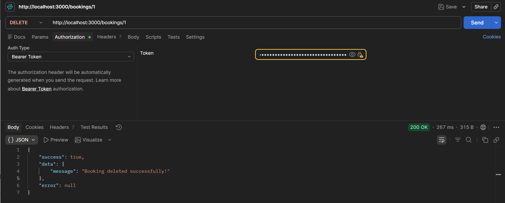
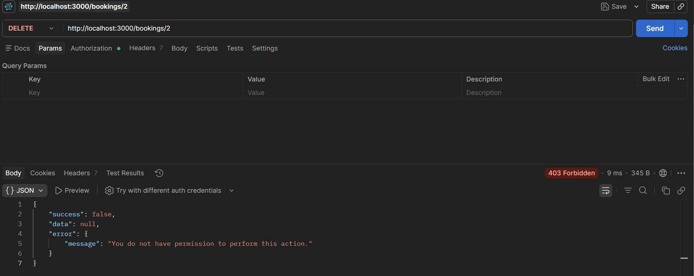
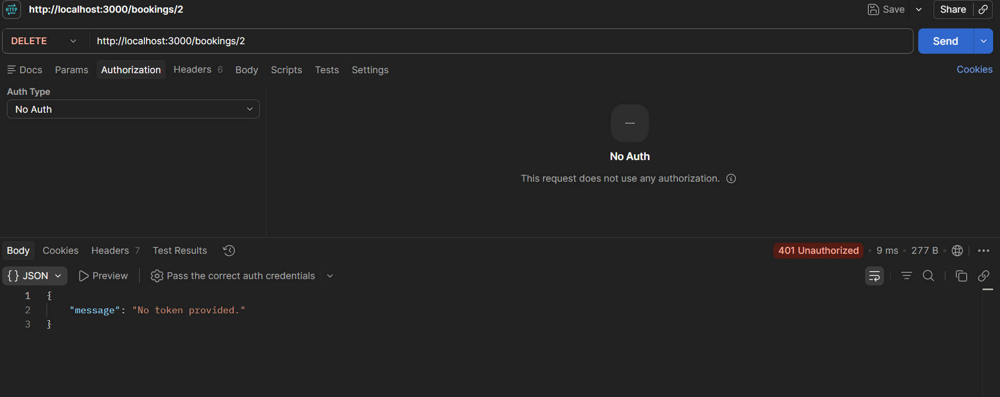
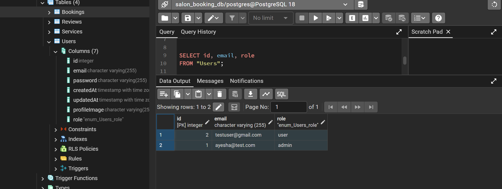

# Salon Booking API — Role-Based Access Control (RBAC)

A REST API for a salon booking system built with Node.js, Express, PostgreSQL, Sequelize, JWT authentication, and Zod validation.

This task adds role-based access control so different users can have different permissions.

## Tech Stack

- Node.js
- Express.js
- PostgreSQL
- Sequelize
- JWT
- bcrypt
- Zod
- Cloudinary
- Multer

---

# Task 8 — Roles and Permissions

The API now supports two roles: `user` and `admin`. New users get the `user` role by default, and some actions — like deleting a booking — are restricted to admins.

---

# Changes Made in This Task

## 1. Added a role field to the User model — `models/User.js`

The User model previously stored just email, password, and profile image. I added a `role` field:

```js
role: {
    type: DataTypes.ENUM("user", "admin"),
    allowNull: false,
    defaultValue: "user"
}
```

It's an enum so the value can only ever be `user` or `admin`, it's required, and it defaults to `user` so nobody ends up with a missing role. Sequelize's `sync({ alter: true })` picked up the new column and updated the table.

## 2. Made sure users can't self-assign admin — `server.js`

The signup endpoint only pulls `email` and `password` from the request body — it never reads `role` from what the client sends:

```js
const { email, password } = req.body;

const user = await User.create({
    email,
    password: hashedPassword
});
```

So even if someone sends `role: "admin"` in their signup payload, it's ignored and the model default (`user`) kicks in. For testing, I assigned the admin role directly in the database instead of building a public "become admin" path.

## 3. Built the authorization middleware — `middleware/authorize.js` (new file)

This is the piece that actually checks permissions. It exports `authorizeRoles()`, which takes the roles allowed to do something:

```js
authorizeRoles("admin")
```

Internally it reads `req.user.role` (set earlier by the auth middleware) and checks it against the allowed list. If it matches, it calls `next()` and the request continues. If not, it returns a `403`:

```js
return next(
    new AppError("You do not have permission to perform this action.", 403)
);
```

## 4. Added role to the JWT — `server.js`

The login endpoint now signs the role into the token along with the user ID and email:

```js
const token = jwt.sign(
    {
        userId: user.id,
        email: user.email,
        role: user.role
    },
    process.env.JWT_SECRET,
    { expiresIn: process.env.JWT_EXPIRES_IN }
);
```

This matters because `authorizeRoles()` needs to know the role without hitting the database again on every request — it just reads it off the decoded token.

## 5. Protected the delete booking route — `server.js`

`DELETE /bookings/:id` used to only require `authenticateToken`. Now it also requires `authorizeRoles("admin")`:

```js
app.delete(
    "/bookings/:id",
    authenticateToken,
    authorizeRoles("admin"),
    catchAsync(async (req, res) => {
        // delete booking
    })
);
```

A normal authenticated user can still use everything else in the API, just not this.

## 6. Kept authentication and authorization separate

`middleware/auth.js` handles authentication — verifying the JWT and attaching the decoded user to `req.user`. If the token's missing or invalid, that's a `401`.

`middleware/authorize.js` handles authorization — checking whether the (already authenticated) user's role is allowed to do the thing they're trying to do. If not, that's a `403`.

Keeping these as two separate middlewares meant I didn't have to duplicate role-checking logic in every route — I just chain `authorizeRoles("admin")` onto whatever route needs it.

## 7. Database

Added the `role` column to the `Users` table and tested with two accounts:

| Email | Role |
| ----- | ---- |
| ayesha@test.com | admin |
| testuser@gmail.com | user |

## 8. Tested three scenarios

- **Admin deletes a booking** → `200 OK`, booking deleted.
- **Normal user tries to delete a booking** → request passes authentication but fails at `authorizeRoles("admin")`, returns `403 Forbidden`.
- **No token at all** → request never even reaches the authorization check, rejected at `authenticateToken` with `401 Unauthorized`.

That confirmed the two failure modes are actually distinct in practice, not just in theory.

---

# 401 vs 403

## 401 Unauthorized

Returned when the request doesn't contain a valid authentication token.

```json
{
    "message": "No token provided."
}
```

## 403 Forbidden

Returned when the user is authenticated but doesn't have the required role.

```json
{
    "success": false,
    "data": null,
    "error": {
        "message": "You do not have permission to perform this action."
    }
}
```

---

# Testing

## Test 1 — Admin User

An authenticated admin user attempted to delete a booking.

**Result:** `200 OK` — the booking was successfully deleted.



## Test 2 — Normal User

An authenticated normal user attempted to delete a booking.

**Result:** `403 Forbidden` — the booking was not deleted.



## Test 3 — No Authentication

A request was sent without a JWT token.

**Result:** `401 Unauthorized` — the request was rejected because no authentication token was provided.



---

# Database Role Testing

```sql
SELECT id, email, role
FROM "Users";
```

Result:

```text
id | email               | role
---+---------------------+------
1  | ayesha@test.com     | admin
2  | testuser@gmail.com  | user
```



---

# Files Changed in Task 8

### Modified

```text
models/User.js
```
Added the `role` field with `user` as the default.

```text
server.js
```
Stopped accepting `role` from the signup payload, added `role` to the JWT, and protected `DELETE /bookings/:id` with `authorizeRoles("admin")`.

### Added

```text
middleware/authorize.js
```
New reusable role-based authorization middleware.

### Database

The `Users` table was updated with the new `role` column.

---

# Project Structure

```text
salon-booking-api/
│
├── config/
│   └── cloudinary.js
│
├── middleware/
│   ├── auth.js
│   ├── authorize.js          # Added in Task 8
│   ├── errorHandler.js
│   ├── upload.js
│   └── validate.js
│
├── models/
│   ├── Booking.js
│   ├── Review.js
│   ├── Service.js
│   └── User.js               # Modified in Task 8
│
├── utils/
│   ├── AppError.js
│   ├── catchAsync.js
│   ├── cloudinaryUpload.js
│   └── response.js
│
├── validators/
│   ├── bookingValidator.js
│   ├── reviewValidator.js
│   └── userValidator.js
│
├── screenshots/
│   ├── task-8-admin-allowed.png
│   ├── task-8-user-forbidden.png
│   ├── task-8-no-token-unauthorized.png
│   └── task-8-user-roles.png
│
├── server.js                  # Modified in Task 8
├── package.json
└── README.md
```

---

# Main API Endpoints

## Authentication

```text
POST /auth/signup
POST /auth/login
```

## Bookings

```text
GET    /bookings
POST   /bookings
PUT    /bookings/:id
DELETE /bookings/:id
```

`DELETE /bookings/:id` requires the `admin` role.

## Reviews

```text
POST /services/:id/reviews
GET  /services/:id/reviews
```

## User

```text
GET  /users/profile
POST /users/profile-picture
```

---

# Running the Project

```bash
npm install
```

Create a `.env` file with the required database, JWT, and Cloudinary configuration.

```bash
npm run dev
```

The API runs on:

```text
http://localhost:3000
```
